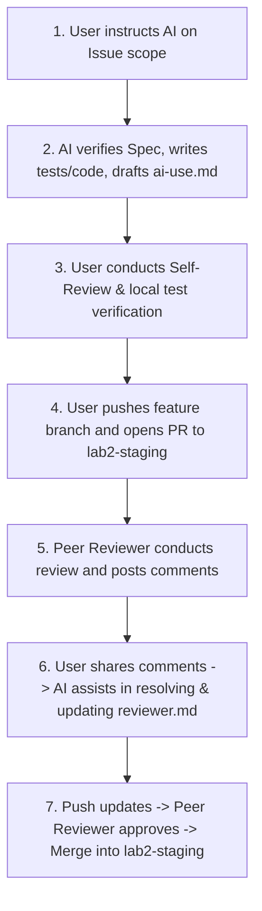

# TokTickIT Lab 2 — AI Collaboration Agreement & Engineering Protocol

This document establishes the collaboration agreement, core engineering rules, and operational workflow between the **Developer (@Phenwatsa)** and the **AI Coding Assistant (Antigravity)** throughout the development of TokTickIT Sprint 2 (Lab 2).

---

## 📌 Core Engineering Principles (5 Rules)

### Rule 1: Always Spec-First & Re-read Requirements
* Before beginning any task or issue, the AI must strictly consult the documentation in `docs/lab-02/`:
  - [`specification.md`](file:///Users/penwatsasaengyenpan/%5B3%5D%20Junior_Work/1_CPE334/Lab/toktickit/docs/lab-02/specification.md) (Sprint Goals, Scope, FRs, BRs, ACs, DoD)
  - [`ui-spec.md`](file:///Users/penwatsasaengyenpan/%5B3%5D%20Junior_Work/1_CPE334/Lab/toktickit/docs/lab-02/ui-spec.md) (Zen Green design tokens, responsive breakpoints, visual checklist)
  - [`api-spec.md`](file:///Users/penwatsasaengyenpan/%5B3%5D%20Junior_Work/1_CPE334/Lab/toktickit/docs/lab-02/api-spec.md) (REST contracts, JSON payloads, HTTP status codes)
  - [`tests.md`](file:///Users/penwatsasaengyenpan/%5B3%5D%20Junior_Work/1_CPE334/Lab/toktickit/docs/lab-02/tests.md) (Planned test table and AC traceability matrix)
* **Never invent business rules or assume behaviors** without explicit user confirmation when ambiguities arise.

### Rule 2: Code Style & Architecture Consistency
* **Formatting**: Strict 2-space indentation, consistent curly bracket positioning, camelCase for functions/variables, PascalCase for React components, and strict TypeScript typings.
* **Section Headers**: Include clear header comments (e.g., `// ---------------------------------------------------------------------------`) with issue references.
* **Architecture**: Maintain clean modular code within `client/src/` and `server/src/` conforming to the existing starter code conventions.

### Rule 3: Issue & Branch Traceability
* Strictly follow the 7 GitHub Issues decomposition (#5 through #11) with corresponding dedicated feature branches:
  1. `docs/lab2-spec-and-test-plan` (Issue 5: Spec DD & Test Plan)
  2. `feature/1-requester-context` (Issue 6: Requester Context & Seed Data)
  3. `feature/2-ticket-creation` (Issue 7: Ticket Creation & Zen Green Form)
  4. `feature/3-my-tickets` (Issue 8: My Tickets Search, Filter, Sort, Pagination)
  5. `feature/4-ticket-detail-attachments` (Issue 9: Ticket Detail & Attachments Lifecycle)
  6. `feature/5-e2e-and-responsive` (Issue 10: E2E Playwright & Responsive Checks)
  7. `docs/lab2-documentation` (Issue 11: Final Docs, Reviewer Log & Release PR)
* Complete one issue at a time. Do not jump across issues or combine multiple issues into a single branch.

### Rule 4: Real-time Prompt Logging (`ai-use.md`)
* For every key user instruction and architectural prompt, the AI will assist in summarizing and appending entries to [`docs/lab-02/ai-use.md`](file:///Users/penwatsasaengyenpan/%5B3%5D%20Junior_Work/1_CPE334/Lab/toktickit/docs/lab-02/ai-use.md) in real time to capture 6–10 representative prompts for the final reflection.

### Rule 5: Peer Review Protocol (`reviewer.md`)
* The review workflow operates as follows:
  1. Once an issue is implemented, the developer performs an internal self-review and runs all tests locally.
  2. The developer pushes the feature branch to GitHub and opens a Pull Request against `lab2-staging`.
  3. The peer reviewer (@lephirada) inspects the PR and leaves review comments/requests for changes.
  4. The developer forwards the reviewer's feedback to the AI.
  5. The AI assists in addressing the feedback, making required code/test adjustments, and formulating formal response records in [`docs/lab-02/reviewer.md`](file:///Users/penwatsasaengyenpan/%5B3%5D%20Junior_Work/1_CPE334/Lab/toktickit/docs/lab-02/reviewer.md).
  6. The developer pushes the revisions, obtains the peer approval, and merges the PR into `lab2-staging`.

---

## 🔄 Issue Development Workflow Diagram

