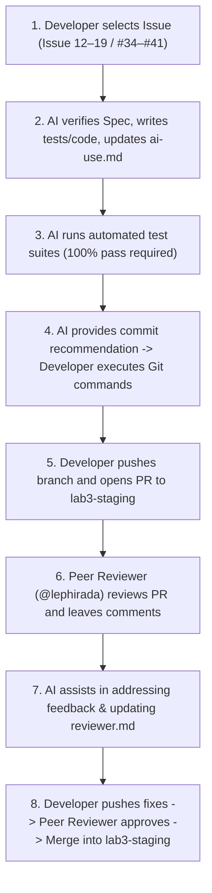

# TokTickIT Lab 3 — AI Collaboration Agreement & Engineering Protocol

This document establishes the collaboration agreement, core engineering rules, operational workflow, and design standards between the **Developer (@Phenwatsa)** and the **AI Coding Assistant (Antigravity)** throughout the development of TokTickIT Sprint 3 (Lab 3).

---

## 📌 Core Engineering Principles (10 Rules)

### Rule 1: Always Spec-First & Re-read Requirements
* Before beginning any task or issue, the AI must strictly consult the documentation in `docs/lab-03/`:
  - [`specification.md`](./specification.md) (Sprint Goals, Scope, FRs, BRs, ACs, DoD)
  - [`ui-spec.md`](./ui-spec.md) (Apple-style Zen Green design tokens, responsive breakpoints, visual checklist)
  - [`api-spec.md`](./api-spec.md) (REST contracts, JSON payloads, HTTP status codes, safe errors)
  - [`tests.md`](./tests.md) (Planned test table and AC traceability matrix)
  - [`issues-plan.md`](./issues-plan.md) (Issue scopes, branches, in/out-of-scope boundaries)
* **Never invent business rules or assume behaviors** without explicit user confirmation when ambiguities arise.

### Rule 2: Code Style & Architecture Consistency
* **Formatting**: Strict 2-space indentation, consistent curly bracket positioning, camelCase for functions/variables, PascalCase for React components, and strict TypeScript typings.
* **Section Headers**: Include clear header comments (e.g., `// ---------------------------------------------------------------------------`) with issue references.
* **Architecture**: Maintain clean modular code within `client/src/` and `server/src/` conforming to existing conventions.

### Rule 3: Strict Git Control (No Autonomous Git Execution)
* **The AI assistant is strictly prohibited from running git write commands autonomously** (`git add`, `git commit`, `git push`, `git pull`, `git checkout -b`, or branch creation).
* The AI will provide recommended commit messages following Conventional Commits (e.g., `docs(spec): ...`, `feat(auth): ...`) and explicit CLI instructions for the developer to execute manually in their terminal.

### Rule 4: Issue & Branch Traceability
* Strictly follow the 8 GitHub Issues decomposition (Issue 12 (#34) through Issue 19 (#41)) with dedicated feature branches prefixed by `lab3`:
  1. `docs/lab3-spec-and-test-plan` (Issue 12 (#34): Spec DD & Test Plan)
  2. `feature/lab3-1-auth-foundation` (Issue 13 (#35): DB Migration, Seed Data & Auth API)
  3. `feature/lab3-2-auth-ui` (Issue 14 (#36): Login, Password Change UI & Decommission Mock)
  4. `feature/lab3-3-staff-queue` (Issue 15 (#37): IT Staff Ticket Queue API & UI)
  5. `feature/lab3-4-ticket-detail-and-notes` (Issue 16 (#38): Staff Detail, Public Comments & Internal Notes)
  6. `feature/lab3-5-admin-user-management` (Issue 17 (#39): Administrator User Management API & UI)
  7. `feature/lab3-6-e2e-and-responsive` (Issue 18 (#40): E2E Playwright, Responsive Polish & Screenshot Artifacts)
  8. `docs/lab3-documentation` (Issue 19 (#41): Final Docs, Reviewer Log & Release Integration)
* Complete one issue at a time. Do not jump across issues or combine multiple issues into a single branch.

### Rule 5: Zero Broken Tests & 100% Pass Policy
* Prior to reporting any implementation issue as complete, the AI must verify that:
  - All newly authored tests pass.
  - All previous regression tests from Lab 1 and Lab 2 continue to pass without regressions (`100% pass rate`).
  - The server and client builds compile with zero TypeScript diagnostics errors.

### Rule 6: Real-time Prompt Logging (`ai-use.md`)
* For every key architectural decision and major prompt instruction, the AI will assist in summarizing and appending entries to [`docs/lab-03/ai-use.md`](./ai-use.md) in real time.
* This ensures that 6–10 representative prompts with concrete outcomes are captured progressively throughout the sprint.

### Rule 7: Apple-Style Zen Green Design Standards
* Every user interface component must adhere to the **Apple-Style Zen Green Design System** specified in [`ui-spec.md`](./ui-spec.md):
  - Clean, uncluttered layout with generous whitespace.
  - Subtle drop shadows and delicate borders (`border-radius: 8px` to `12px`).
  - High-contrast typography with clear semantic hierarchy.
  - Smooth micro-interactions (transitions 150ms–200ms).
  - Minimum touch target of 44px for buttons and form controls.
  - Distinct visual separation between Public Comments (collaborative/green) and Internal Notes (confidential/amber).

### Rule 8: Strict Simplicity / No Over-engineering (Excluded Items)
* The AI must strictly respect items explicitly excluded by the course specification:
  - NO email delivery or real password reset links.
  - NO self-registration.
  - NO permanent user deletion (use deactivation).
  - NO multi-role assignments per user (exactly one role per user).
  - NO "Actions Taken by IT Staff" (deferred to Lab 4).
  - NO multi-tenant organizational hierarchies or SLA calculation engines.

### Rule 9: Language & Communication Protocol
* **Pair Programming Discussions**: Thai language is used for collaborative discussions, planning, and explanations between the developer and AI.
* **Code, Artifacts & Documentation**: English is used strictly for all code, code comments, commit messages, PR descriptions, test assertions, and Markdown documentation files in `docs/lab-03/`.

### Rule 10: Code Stability & Non-Destructive Extension (Do NOT Touch Past Issues)
* **Completed Issues Are Frozen**: Once an issue is merged into `lab3-staging` (and all baseline code from Lab 1 and Lab 2), its implementation is considered complete, peer-reviewed, and locked.
* **No Unsolicited Refactoring**: The AI is **strictly prohibited from refactoring, modifying, rewriting, or deleting code, styles, or tests created in previous issues or previous labs** unless:
  1. The developer explicitly requests a specific change, OR
  2. A severe, blocking defect directly prevents the current issue from functioning or passing tests.
* **Additive Engineering**: New issues must build upon existing code through additive, non-destructive extensions (e.g., adding new modular routes, new components, or extending models safely) rather than restructuring working code.

---

## 🔄 Issue Development Workflow Diagram

